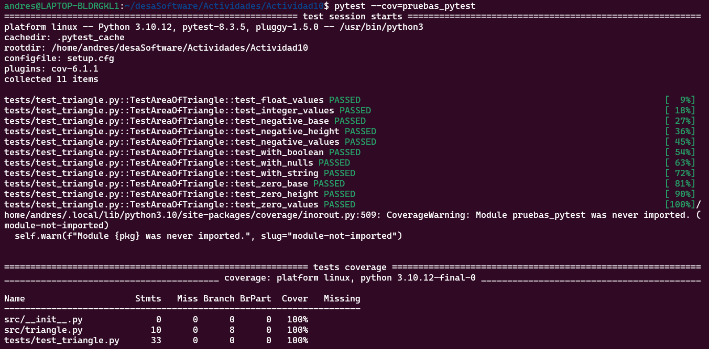
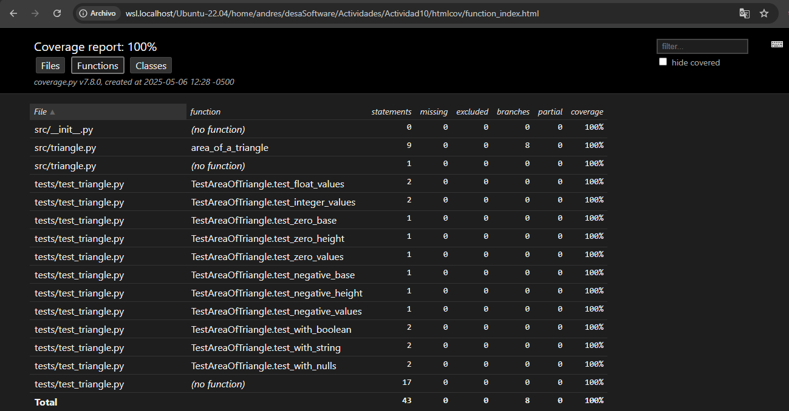

# Actividad 10 : Ejecutar pruebas con pytest

**Autor:** La Torre Vasquez Andres

**Herramientas utilizadas:** `pytest`, `pytest-cov`  
**Versión de pytest:** `pytest 8.3.5`

### Objetivo General
Aplicar técnicas de pruebas automatizadas utilizando `pytest` y generar informes de cobertura mediante `pytest-cov`.

### Objetivos Específicos
- Instalar y configurar `pytest` y `pytest-cov`.
- Escribir y ejecutar pruebas unitarias con `pytest`.
- Generar informes detallados de cobertura de código.
- Automatizar la configuración de pruebas mediante `setup.cfg` o `pytest.ini`.
- Visualizar resultados de cobertura en consola y en formato HTML.

## Instalación y Configuración Inicial

Se utilizó el gestor de paquetes `pip` para instalar `pytest` y `pytest-cov`:

```bash
python3 -m pip install pytest pytest-cov

pruebas_pytest/
├── setup.cfg
├── src
    ├──triangle.py
└── tests
    └──test_triangle.py
```

### Generación de Informes de Cobertura
### 🔹 Ejecución con cobertura básica

```bash
pytest --cov=pruebas_pytest
```

**Este comando:**

- Ejecuta las pruebas.

- Mide la cobertura de todos los archivos del paquete indicado (pruebas_pytest).

- Muestra un resumen en consola con el porcentaje de líneas cubiertas.

### Informe detallado de líneas no cubiertas
```bash
pytest --cov=triangle --cov-report=term-missing
```

- Muestra línea por línea qué partes del archivo triangle.py no están siendo ejecutadas durante las pruebas.

- Es ideal para detectar casos de prueba faltantes o funciones no testeadas.

### Generación de reporte en HTML
```bash
pytest --cov=triangle --cov-report=html
```
- Crea un directorio htmlcov/ que contiene un informe visual e interactivo.




Podemos combinar ambos con 

```bash
pytest --cov=triangle --cov-report=term-missing --cov-report=html
```

### Salida con colores

La salida por defecto de pytest tiene soporte nativo para colores pero si no se muestra correctamente podemos usar 
```bash
pytest --color=yes
```

### Automatización con setup.cfg y pytest.ini

#### **setup.cfg**
```python
[tool:pytest]
addopts = -v --tb=short --cov=. --cov-report=term-missing

[coverage:run]
branch = True

[coverage:report]
show_missing = True
```

- addopts: opciones predeterminadas al ejecutar pytest.

- --tb=short: traza de error resumida (más limpia).

- --cov=.: calcula la cobertura de todo el paquete actual.

- --cov-report=term-missing: muestra líneas no cubiertas en consola.

- branch=True: activa la cobertura de ramas condicionales.

- show_missing=True: indica qué líneas no han sido cubiertas.

#### **pytest.ini**

Archivo exclusivo para la configuración de pytest, útil cuando se quiere separar la configuración de herramientas.
```python
[pytest]
addopts = -v --tb=short --cov=. --cov-report=term-missing

[coverage:run]
branch = True

[coverage:report]
show_missing = True
```

