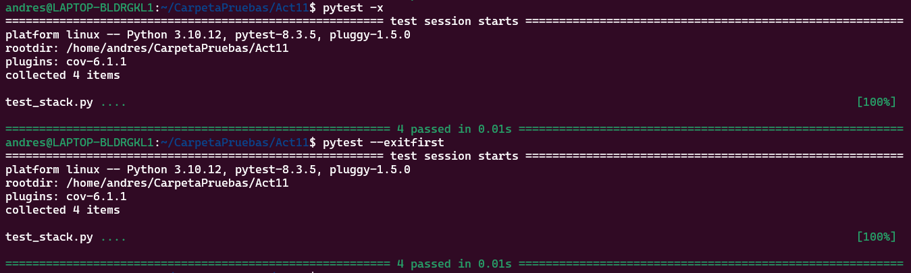

# Actividad 11: Escribir aserciones en pruebas con pytest

En esta actividad se aprendió a escribir aserciones de pruebas utilizando `pytest` y complementos modernos como `pytest-cov`.

### Objetivos de aprendizaje

Después de completar esta actividad, se lograron los siguientes objetivos:

- Ejecutar casos de prueba con `pytest`
- Identificar los casos de prueba que fallan
- Escribir pruebas unitarias utilizando aserciones (`assert`)
- Generar informes de cobertura usando `pytest-cov`

---

## Paso 1: Instalación de pytest y pytest-cov

Se instalaron las herramientas necesarias para ejecutar pruebas y generar informes de cobertura de código. Se ejecutó el siguiente comando en la terminal:

```bash
python3 -m pip install pytest pytest-cov
```

## Paso 2: Archivos de prueba

Se trabajó con dos archivos:

- stack.py: Contiene la implementación de una estructura de datos tipo pila (Stack).

- test_stack.py: Contiene pruebas para los métodos push(), pop(), peek() e is_empty() de la clase Stack.

### Función de cada método:

| Método     | Descripción                                         |
|------------|-----------------------------------------------------|
| `push()`   | Añade un elemento a la parte superior de la pila    |
| `pop()`    | Elimina y devuelve el elemento en la parte superior |
| `peek()`   | Devuelve el elemento superior sin eliminarlo        |
| `is_empty()` | Retorna `True` si la pila está vacía, `False` si no |


Podemos verificar los tests con 
```bash
pytest -v
```

Si deseas que pytest se detenga al primer fallo podemos usar estas opciones:
```bash
pytest -x
# o
pytest --exitfirst
```
Por defecto pytest no ejecuta las pruebas en orden aleatorio. Las pruebas se ejecutan en el mismo orden en que están definidas en los archivos .py.

Si deseamos ejecutar las pruebas en orden aleatorio podemos usar el plugin pytest-random-order.
```bash
pip install pytest-random-order
pytest --random-order
```
 

 


## Paso 3: Escribiendo aserciones para el método `is_empty()`

El método `is_empty()` devuelve `True` si la pila está vacía y `False` si contiene al menos un elemento. Esta es una funcionalidad básica pero crucial, ya que permite comprobar el estado inicial o final de la pila.

### Prueba con `pytest`:

```python
def test_is_empty():
    stack = Stack()
    assert stack.is_empty() == True  # La pila recién creada debe estar vacía
    stack.push(5)
    assert stack.is_empty() == False  # Después de agregar un elemento, la pila no debe estar vacía
```

Prueba altenativa
```python
def test_pop_with_setup(self) -> None:
    """Prueba de eliminar elementos usando self.stack."""
    self.stack.push(3)
    self.stack.push(5)
    self.assertEqual(self.stack.pop(), 5, "El valor superior debe ser 5")
    self.assertEqual(self.stack.peek(), 3, "Después de pop(), el valor superior debe ser 3")
    self.stack.pop()
    self.assertTrue(self.stack.is_empty(), "La pila debe estar vacía después de eliminar todos los elementos")
```
Este método no solo comprueba la funcionalidad de pop() y peek() sino que también verifica que is_empty() sea preciso tras vaciar la pila.

## Paso 5: Escribiendo aserciones para el método `peek()`

El método `peek()` devuelve el valor en la parte superior de la pila sin eliminarlo. Es fundamental para inspeccionar el último valor insertado sin modificar el estado de la pila.

Se implementaron dos versiones de prueba para comprobar el correcto funcionamiento de este método.

### Prueba con `assert`:

```python
def test_peek():
    stack = Stack()
    stack.push(1)
    stack.push(2)
    assert stack.peek() == 2  # El valor superior debe ser el último agregado (2)
    assert stack.peek() == 2  # La pila no debe cambiar después de peek()
```
**PRUEBA ALTERNATIVA**
```python
def test_peek_with_setup(self) -> None:
        """Prueba de observar el elemento superior usando self.stack."""
        self.stack.push(3)
        self.stack.push(5)
        self.assertEqual(self.stack.peek(), 5, "El valor superior debe ser 5")
```
## Paso 6: Escribiendo aserciones para el método `pop()`

El método `pop()` elimina y devuelve el valor en la parte superior de la pila. Para asegurar que la prueba sea efectiva, es importante agregar al menos dos elementos a la pila. Esto permite comprobar que se está removiendo correctamente el último elemento insertado (LIFO: Last In, First Out).

### Prueba de pop():

```python
def test_pop():
    stack = Stack()
    stack.push(1)
    stack.push(2)
    assert stack.pop() == 2  # El valor superior (2) debe eliminarse y devolverse
    assert stack.peek() == 1  # Después de pop(), el valor superior debe ser 1
```
PRUEBA ALTERNATIVA(misma que usamos en el paso 3)
```python
def test_pop_with_setup(self) -> None:
        """Prueba de eliminar elementos usando self.stack."""
        self.stack.push(3)
        self.stack.push(5)
        self.assertEqual(self.stack.pop(), 5, "El valor superior debe ser 5")
        self.assertEqual(self.stack.peek(), 3, "Después de pop(), el valor superior debe ser 3")
        self.stack.pop()
        self.assertTrue(self.stack.is_empty(), "La pila debe estar vacía después de eliminar todos los elementos")
```


## Paso 7: Escribiendo aserciones para el método `push()`

El método `push()` agrega un valor a la pila. Para probar su funcionamiento se desarrollaron dos versiones de prueba, ambas verificando que el nuevo valor se encuentre correctamente en la parte superior.

### Prueba con `assert`:

```python
def test_push():
    stack = Stack()
    stack.push(1)
    assert stack.peek() == 1  # El valor recién agregado debe estar en la parte superior
    stack.push(2)
    assert stack.peek() == 2  # Después de otro push, el valor superior debe ser el último agregado
```
PRUEBA ALTERNATIVA 
```PYTHON
def test_push_with_setup(self) -> None:
        """Prueba de insertar elementos usando self.stack."""
        self.stack.push(3)
        self.assertEqual(self.stack.peek(), 3, "El valor recién agregado debe ser 3")
        self.stack.push(5)
        self.assertEqual(self.stack.peek(), 5, "El valor recién agregado debe ser 5")
```

 
## Paso 9: Agregando cobertura de pruebas con `pytest-cov`

Para asegurarnos de que las pruebas cubren suficiente código podemos generar un informe de cobertura utilizando el plugin `pytest-cov`. Ejecutando el siguiente comando:

```bash
pytest --cov=stack --cov-report=term-missing
```

 
### Archivo setup.cfg
Este archivo de configuración para pytest y coverage que personaliza cómo se ejecutan las pruebas y cómo se recopila el informe de cobertura de código.

```bash
[tool:pytest]
addopts = -v --tb=short --cov=stack --cov-report=term-missing

[coverage:run]
branch = True
omit =
    */tests/*
    */test_*

[coverage:report]
show_missing = True
```

**[tool:pytest]**
- -v: Ejecuta pytest en modo detallado (verbose), mostrando más información sobre cada prueba.

- --tb=short: Muestra trazas de errores resumidas (short traceback).

- --cov=stack: Indica que pytest debe calcular la cobertura de código para el archivo o módulo stack.py.

- --cov-report=term-missing: Muestra el informe de cobertura en la terminal, incluyendo las líneas que no fueron ejecutadas.

**[coverage:run]**

- branch = True: Habilita cobertura de ramas condicionales. Esto es útil para verificar si todas las ramas de un if, else, etc., han sido ejecutadas.

- omit: Excluye del análisis archivos que no necesitas cubrir:

- */tests/*: Excluye cualquier archivo dentro del directorio tests.

- */test_*: Excluye cualquier archivo que empiece con test_.

**[coverage:report]**

- show_missing = True: Muestra las líneas exactas que no han sido cubiertas por las pruebas, facilitando la mejora de la cobertura.
