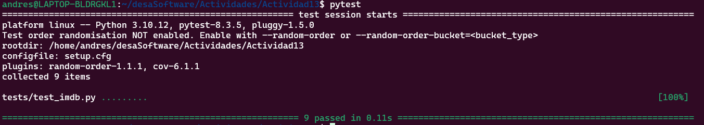

# Actividad 13
## Introducción

La actividad tiene como propósito introducir y ejercitar el uso de **mocking** y **patching** en pruebas unitarias, especialmente para sistemas que dependen de APIs externas, como **IMDb**. Mockear permite **aislar el código propio** evitando llamadas reales a servicios externos, mejorando así la eficiencia, confiabilidad y control de las pruebas.

---

## Objetivos 

- Utilizar **fixtures de prueba** para simular respuestas de APIs reales.
- Usar el decorador `@patch` para interceptar funciones o métodos durante las pruebas.
- Emplear la clase `Mock` de `unittest.mock` para simular objetos.
- Escribir casos de prueba robustos que utilicen datos controlados y consistentes.

---

##  Estructura del Proyecto
```bash
├── models/
│ └── imdb.py # Implementación de la clase IMDb
├── tests/
│ ├── test_imdb.py # Casos de prueba para IMDb
│ └── fixtures/
│ └── imdb_responses.json # Respuestas mockeadas de IMDb
```

## Fundamentos Técnicos

### ¿Qué es mocking?

Con Mocking podemos **crear objetos falsos** que simulan el comportamiento de objetos reales.

- Lo podemos usar cuando el objeto real **no está disponible**.
- No se desea realizar **llamadas reales** a servicios externos.
- Se desea controlar y reproducir **respuestas específicas**.

### ¿Qué es patching?

Patching permite **sustituir temporalmente** funciones u objetos en el ámbito de prueba. Esto se hace mediante el decorador `@patch`.

---

## ⚙️ Herramientas Usadas

- `pytest`: Framework para ejecutar las pruebas.
- `unittest.mock`:
  - `Mock`: Para crear objetos falsos.
  - `patch`: Para interceptar llamadas a métodos o funciones reales.
- `json`: Para cargar fixtures desde archivos JSON.

---

## Paso 1: Prueba de búsqueda por título exitosa

Objetivo: Asegurar que search_titles() retorna resultados esperados sin llamar a la API real.

```python
@patch('test_imdb.IMDb.search_titles')
    def test_search_by_title(self, imdb_mock):
        """Prueba de búsqueda por título"""
        imdb_mock.return_value = self.imdb_data["search_title"]  # <-- CAMBIA AQUÍ
        imdb = IMDb("k_12345678")
        resultados = imdb.search_titles("Bambi")
        assert resultados is not None
        assert resultados.get("errorMessage") is None
        assert resultados.get("results") is not None
        assert resultados["results"][0]["id"] == "tt1375666"
```


## Paso 2: Prueba de búsqueda sin resultados
Simular un fallo en la búsqueda

Mock aplicado: requests.get (usado internamente en IMDb.search_titles)

```python
@patch('models.imdb.requests.get')
    def test_search_with_no_results(self, imdb_mock):
        """Prueba de búsqueda sin resultados"""
        mock_response = Mock(status_code=404)
        mock_response.json.return_value = {}
        imdb_mock.return_value = mock_response
        imdb = IMDb("k_12345678")
        resultados = imdb.search_titles("TituloInexistente")
        assert resultados == {}
```
## Paso 3: Prueba de API key inválida

Simular un error devuelto por IMDb al usar una API key inválida.

Mock aplicado: requests.get con retorno .json()
```python
@patch('models.imdb.requests.get')
    def test_search_by_title_failed(self, mock_get):
        """Prueba de búsqueda por título fallida"""
        # Configurar el mock para devolver una respuesta con API Key inválida
        mock_response = Mock(
            spec=Response,
            status_code=200,
            json=Mock(return_value=self.imdb_data["INVALID_API"])
        )
        mock_get.return_value = mock_response

        imdb = IMDb(apikey="bad-key")
        resultados = imdb.search_titles("Bambi")

        assert resultados is not None
        assert resultados["errorMessage"] == "Invalid API Key"
```

## Paso 4: Prueba de calificaciones de película
Validar que movie_ratings() procesa correctamente las calificaciones mockeadas.

Mock aplicado: requests.get

```python
@patch('models.imdb.requests.get')
    def test_movie_ratings(self, imdb_mock):
        """Prueba de calificaciones de películas"""
        imdb_mock.return_value = Mock(
            spec=Response,
            status_code=200, 
            json=Mock(return_value=self.imdb_data["GOOD_RATING"])
        )
        imdb = IMDb("k_12345678")
        resultados = imdb.movie_ratings("tt1375666")
        assert resultados is not None
        assert resultados["title"] == "Bambi"
        assert resultados["filmAffinity"] == 3
        assert resultados["rottenTomatoes"] == 5
```
## Compracion de resultados


