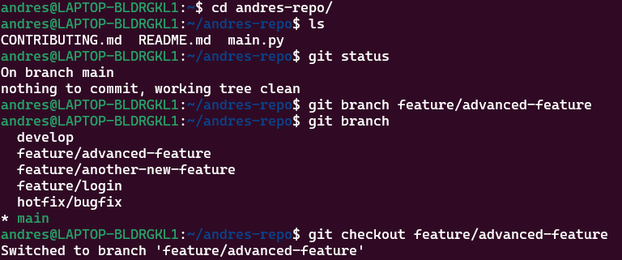
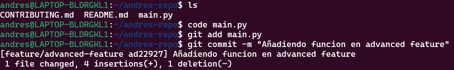

# Ejercicio 1: Manejo avanzado de ramas y resolución de conflictos

## Procedimiento

### 1. Crear una nueva rama para una característica
Primero creamos una nueva rama llamada `feature/advanced-feature` desde la rama `main`:

**Nota:** Hay ramas ya creadas asi como los archivos readme.md, main.py y contributing.md que fueron creados en la parte teorica de la actividad pero no coloque el procedimiento de esa parte por temas de espacio, Continuamos con la actividad.

```bash
$ git branch feature/advanced-feature
$ git checkout feature/advanced-feature
```


### 2.Modificar archivos en la nueva rama:

Editamos el archivo main.py para incluir una función adicional, la carpeta main ya fue creada anteriormente en la parte teorica de la actividad por lo cual solo lo editamos directamente 

```python
def greet():
    print('Hello from advanced feature')

greet()
```
Añadimos y confirmamos estos cambios en la rama feature/advanced-feature

```bash 
$ git add main.py
$ git commit -m "Add greet function in advanced feature"
```


### 3.Simular un desarrollo paralelo en la rama main:

Cambiamos de nuevo a la rama main
```bash 
$ git checkout main
```
Editamos el archivo main.py de forma diferente :
```python
print('Hello World - updated in main')
```
Añadimos y confirmamos estos cambios en la rama main:
```bash
$ git add main.py
$ git commit -m "Update main.py message in main branch"
```

### 4.Intentar fusionar la rama feature/advanced-feature en main:

Fusionamos la rama feature/advanced-feature en main 
```bash
$ git merge feature/advanced-feature
```
### 5.Resolver el conflicto de fusión:
Cuando hicimos el merge nos genero un problema ya que son dos codigos complemtamente diferentes por lo cual debemos entrar al codigo y acomodar la estructura del programa

Después de resolver el conflicto, añadimos el archivo resuelto y completa la fusión:

```bash
$ git add main.py
$ git commit -m "Resolve merge conflict between main and feature/advanced-feature"
```


### 6.Eliminar la rama fusionada:

Como fusionamos con exito los conflictos eliminamos la rama feature/advanced-feature 

```bash
$ git branch -d feature/advanced-feature
```


como podemos ver se elimino la rama y nos quedamos con las ramas que creamos en la parte teorica.

# Ejercicio 2: Exploración y manipulación del historial de commits

1. Ver el historial detallado de commits:

Usaremos git log para explorar el historial de commits y en este caso añadiremos el -p para mostrar las diferencias entre estas

```bash
$ git log -p
```


**En feature/advanced-feature (commit ad22927)**

•   Se añadió una nueva función a main.py.

**En main (commit e0fad9c)**

•	Se actualizó el mensaje del print() en main.py.

**Se realizó un merge (commit 65d0c2f)**

•	Se combinaron los cambios de ambas ramas.

•	Posiblemente hubo conflictos que resolviste manualmente.

2. Filtrar commits por autor:

Usaremos el siguiente comando para mostar los commits hechos por el autor especificado 

```bash
$ git log --author="Jun1el"
```


3. Revertir un commit:

Si el ultimo commit mas reciente no se hubiera querido hacer usaremos git revert para revertir ese commit.

**Nota** :
El ultimo commmit fue un merge entonces el revert va a tener conflictos, por lo que agregaremos 4 commits adicionales para seguir con el ejercicio de manera adecuada

```bash
$ git revert HEAD
```


Podemos observar que nos lanzo un error por lo que edite el archivo main.py agregandole 4 commits adicionales 


Ahora si hacemos el revert 


¿Que es lo que paso? el commit se mantiene pero los cambios que hize en main se volvieron a como estaba en el tercer commit lo que nos ayudaría mucho en regresar en el tiempo en proyectos.

4. Rebase interactivo:

Realizaremos un rebase interactivo para combinar varios commits en uno solo. Esto es útil para limpiar el historial de commits antes de una fusión.

Usaremos el siguiente comando:

```bash
$ git rebase -i HEAD~3
```


Aqui se me paso tomar captura al Nano que se abrio cuando hacemos el rebase ahi solo tenemos que cambiar el texto de pick a squash y luego nos pedira si queremos modificar el mensaje de el commit luego confirmamos los cambios y listo.

5. Visualización gráfica del historial:

Usaremos el siguiente comando 

```bash
$ git log --graph --oneline --all
```


Primero definamos un poco, el asterisco es un commit, las barras es la rama en la que estoy si es recta es pq estoy trabajando en la misma rama y si se divide es pq cree otra rama y si se unen es pq hize un merge como podemos ver ahí la fusión que hize.

Me parece muy didáctica la manera en la que git grafica el historial de commits yaque lo hace muy entendible al menos para este proyecto.

Y así fue como quedo mi main.py como podemos ver al final me quedo 3 lineas de mas pq una se elimino con el revert  y los 3 ultimos commit se juntaron con el rebase 


# Ejercicio 3: Creación y gestión de ramas desde commits específicos

1. Crear una nueva rama desde un commit específico:

Para esto primero veremos el historial de commit y elegiremos en este caso escogi el ultimo commit y procedi con el comando 

```bash
git log --oneline
$ git branch bugfix/rollback-feature a9a6ff2
$ git checkout bugfix/rollback-feature
```


2. Modificar y confirmar cambios en la nueva rama:

Realizamos un cambio en main.py que simule correccion de errores

```python
def greet():
    print('Fixed bug in feature')
```
Añade y confirma los cambios en la nueva rama:
```bash
$ git add main.py
$ git commit -m "Fix bug in rollback feature"
```


3. Fusionar los cambios en la rama principal:

Cambiamos a la rama main y fusionamos con la rama bugfix/rollback-feature:

```bash
$ git checkout main
$ git merge bugfix/rollback-feature
```


4. Explorar el historial después de la fusión:

Usamos el comando ya conocido 

```bash
git log --graph --oneline
```


5. Eliminar la rama bugfix/rollback-feature:

```bash 
$ git branch -d bugfix/rollback-feature
```


# Ejercicio 4: Manipulación y restauración de commits con git reset y git restore

1. Hacer cambios en el archivo main.py:

Editamos main.py para añadir un commit de prueba 

```python
print('This change will be reset')
```
Añade y confirma los cambios:

```bash
$ git add main.py
$ git commit -m "Introduce a change to be reset"
```


2. Usar git reset para deshacer el commit:

Deshacimos el commit utilizando git reset para volver al estado anterior:

```bash
$ git reset --hard HEAD~1
```


3. Usar git restore para deshacer cambios no confirmados:

Realizamos un cambio en README.md y no lo confirmamos:

```bash
$ echo "Another line in README" >> README.md
$ git status
```

Y usamos git restore para deshacer este cambio no confirmado:
```bash
$ git restore README.md
```


# Ejercicio 5: Trabajo colaborativo y manejo de Pull Requests

1. Crear un nuevo repositorio remoto:

Use ssh porque tengo mi key privada en mi wsl

```bash
$ git clone git@github.com:Jun1el/Act4-Problema5.git
```


2. Crear una nueva rama para desarrollo de una característica:

En mi repositorio cree la rama feature/team-feature

```bash
$ git branch feature/team-feature
$ git checkout feature/team-feature
```


3. Realizar cambios y enviar la rama al repositorio remoto:

Agregamos un print en el archivo collaboration.py que creamos y confirmamos los cambios

```bash
$ echo "print('Collaboration is key!')" > collaboration.py
$ git add .
$ git commit -m "Add collaboration script"
```

Enviamos la rama al repositorio remoto:

```bash
$ git push origin feature/team-feature
```


4. Abrir un Pull Request:

Abrimos un Pull Request (PR) en Github para fusionar feature/team-feature con la rama main y añadimos una descripción detallada del PR, explicando los cambios realizados y su propósito.


5. Revisar y fusionar el Pull Request:

Simula la revisión de código, comenta en el PR y realiza cualquier cambio necesario basado en la retroalimentación.

Primero vemos los cambios hechos en el PR


Añadimos un comentario sobre el contenido


Aceptamos los cambios y confirmamos el merge y nos deberia quedar asi 


Vemos que se fucionaron las ramas


6. Eliminar la rama remota y local:

Después de la fusión, eliminamos la rama tanto local como remotamente:

```bash
$ git branch -d feature/team-feature
$ git push origin --delete feature/team-feature
```


# Ejercicio 6: Cherry-Picking y Git Stash