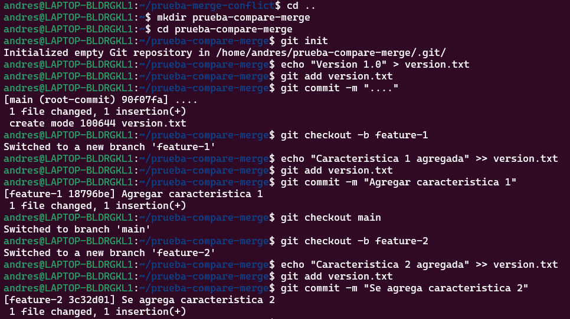

# Actividad 5: Explorando diferentes formas de fusionar en Git

## Ejemplos
## 1. Fusión Fast-forward (git merge --ff)

La fusión fast-forward es la forma más simple de combinar ramas en Git. Solo es posible cuando la rama base no ha recibido nuevos commits desde que se creó la rama feature.

Seguimos la ruta mostrada: 


**Mostramos la estructura de los commits resultante.**

```bash
$ git checkout main
$ git merge add-description

$ git log --graph --oneline
```


## 2. **Fusión No-fast-forward (git merge --no-ff)**

La fusión no-fast-forward crea un nuevo commit de fusión. Es útil para preservar el contexto de la fusión, especialmente en equipos donde se requiere más claridad en el historial de cambios.


**Mostramos la estructura de los commits resultante.**
```bash
$ git checkout main
$ git merge --no-ff add-feature

$ git log --graph --oneline
```


## 3. **Fusión squash (git merge --squash)**

La fusión squash combina todos los cambios de una rama en un solo commit en la rama principal. Este método es útil cuando se quiere mantener un historial de commits limpio.


**¿Cuál es tu estructura de commits?**

```bash
$ git checkout main
$ git merge --squash add-basic-files

$ git add .
$ git commit -m "Agregar documentación estándar del repositorio"
$ git log --graph --oneline
```


# Ejercicios

1. Clona un repositorio Git con múltiples ramas.
Identifica dos ramas que puedas fusionar utilizando git merge --ff.
Haz el proceso de fusión utilizando git merge --ff.
Verifica el historial con git log --graph --oneline.

- Pregunta: ¿En qué situaciones recomendarías evitar el uso de git merge --ff? Reflexiona sobre las desventajas de este método.

    - Pierdes el contexto de la rama:

        No queda rastro de que alguna vez hubo otra rama. Todo se ve como si hubieras trabajado directamente en main lo que hace dificil rastrear cambios si estamos en equipos colaborativos.

        Ademas dificulta rollbacks cuando queremos deshacer una funcion entera es mas facil cuando hay un commit en especifico.

2. Simula un flujo de trabajo de equipo.
Trabaja en dos ramas independientes, creando diferentes cambios en cada una.
Fusiona ambas ramas con git merge --no-ff para ver cómo se crean los commits de fusión.
Observa el historial utilizando git log --graph --oneline.

- Pregunta: ¿Cuáles son las principales ventajas de utilizar git merge --no-ff en un proyecto en equipo? ¿Qué problemas podrían surgir al depender excesivamente de commits de fusión?

    - Tener un historial claro y estructurado para un mejor control de versiones, tambien ayuda a las revisiones de codigo ya que cada commit esta documentado ademas en que el codigo en los commits.
    - Si haces merges muy seguido y sin necesidad el git log se llena de commits de fusión dificultando la lectura.Ademas al hacer varias fusiones complicaria si queremos hacer un rebase futuro.

3. Crea múltiples commits en una rama.
Haz varios cambios y commits en una rama feature.
Fusiona la rama con git merge --squash para aplanar todos los commits en uno solo.
Verifica el historial de commits antes y después de la fusión para ver la diferencia.

- Pregunta: ¿Cuándo es recomendable utilizar una fusión squash? ¿Qué ventajas ofrece para proyectos grandes en comparación con fusiones estándar?

    - Se recomiendo cuando tenemos muchos commits pequeños o sin mucha importancia individual y queremos mantener el historial limpio y legible al trabajar en una rama aislada que no requiere mantener cada paso.
## Resolver conflictos en una fusión non-fast-forward

En algunos casos, las fusiones no son tan sencillas y pueden surgir conflictos que necesitas resolver manualmente. Este ejercicio te guiará a través del proceso de manejo de conflictos.


Regresamos a la rama main y preseguimos


Solucionamos conflicto en el programa en esat ocasion yo use VSC.


### Preguntas:

- ¿Qué pasos adicionales tuviste que tomar para resolver el conflicto?
- ¿Qué estrategias podrías emplear para evitar conflictos en futuros desarrollos colaborativos?

## Ejercicio: Comparar los historiales con git log después de diferentes fusiones



### **Fusionamos feature-1 usando fast-forward:**


### **Fusionamos feature-2 usando non-fast-forward:**


### **Realizamos una nueva rama feature-3 con múltiples commits y fusionamos con squash:**


### **Compara el historial de Git:**

#### Historial Fast-forward:


#### Historial Non-fast-forward


#### Historial con Squash:


Adicional mirando las branches agrupadas en la rama maestra


#### Preguntas:

- ¿Cómo se ve el historial en cada tipo de fusión?
- ¿Qué método prefieres en diferentes escenarios y por qué?


## Ejercicio: Usando fusiones automáticas y revertir fusiones

Inicializamos un nuevo repositorio y realizamos dos commits en main:


Creamos una nueva rama auto-merge y realiza otro commit en file.txt:


Volvemos a main y realizamos cambios no conflictivos en otra parte del archivo:


Fusionamos la rama auto-merge con main:


Revertir la fusión: Si decidimos que la fusión fue un error, podemos revertirla


Verificamos el historial:


### Preguntas:

- ¿Cuándo usarías un comando como git revert para deshacer una fusión?
- ¿Qué tan útil es la función de fusión automática en Git?