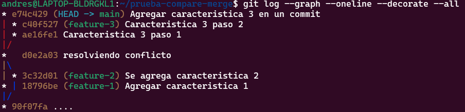

# Actividad 5: Explorando diferentes formas de fusionar en Git

## Ejemplos
## 1. Fusión Fast-forward (git merge --ff)

La fusión fast-forward es la forma más simple de combinar ramas en Git. Solo es posible cuando la rama base no ha recibido nuevos commits desde que se creó la rama feature.

Seguimos la ruta mostrada: 


**Mostramos la estructura de los commits resultante.**

```bash
$ git checkout main
$ git merge add-description

$ git log --graph --oneline
```


## 2. **Fusión No-fast-forward (git merge --no-ff)**

La fusión no-fast-forward crea un nuevo commit de fusión. Es útil para preservar el contexto de la fusión, especialmente en equipos donde se requiere más claridad en el historial de cambios.


**Mostramos la estructura de los commits resultante.**
```bash
$ git checkout main
$ git merge --no-ff add-feature

$ git log --graph --oneline
```


## 3. **Fusión squash (git merge --squash)**

La fusión squash combina todos los cambios de una rama en un solo commit en la rama principal. Este método es útil cuando se quiere mantener un historial de commits limpio.


**¿Cuál es tu estructura de commits?**

```bash
$ git checkout main
$ git merge --squash add-basic-files

$ git add .
$ git commit -m "Agregar documentación estándar del repositorio"
$ git log --graph --oneline
```


# Ejercicios

## Resolver conflictos en una fusión non-fast-forward

En algunos casos, las fusiones no son tan sencillas y pueden surgir conflictos que necesitas resolver manualmente. Este ejercicio te guiará a través del proceso de manejo de conflictos.


Regresamos a la rama main y preseguimos


Solucionamos conflicto en el programa en esat ocasion yo use VSC.


### Preguntas:

## Ejercicio: Comparar los historiales con git log después de diferentes fusiones





