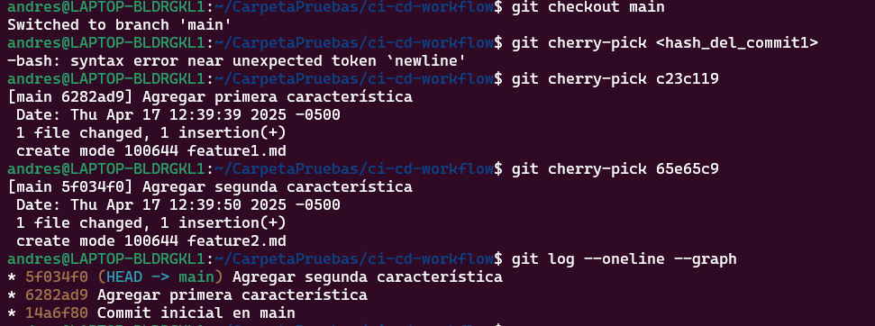
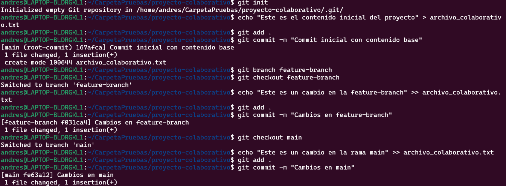

# Actividad 6
-----
## Parte 1: git rebase para mantener un historial lineal

- Creamos un repositorio Git y dos ramas, main y new-feature donde agregamos 1 commit a cada uno respectivamente


Historial de ramas hasta el momento


- Supongamos que alguien agregó un commit a main mientras nosotros trabajamos en new-feature y vemos como el grafico de commits diverge 


- Ahora cambiamos a rama new-feature y hacemos rebase, mostramos el historial de commits y hacemos el merge en main.


## Parte 2: git cherry-pick para la integración selectiva de commit

- Creamos un repositorio para nuestra prueba con dos ramas main y add-base-documents con 1 commit y 2 commits respectivamente; Observamos el log de la rama add-base-documents.


- Hacemos cherry pick a un commit especifico en mi caso escogi el hash de CONTRIBUTING.md y procedemos a ver el historial de commits


## Preguntas de discusion:
1. ¿Por qué se considera que rebase es más útil para mantener un historial de proyecto lineal en comparación con merge?

Porque rebase reescribe en los commits y los coloca en la parte superior de la rama a diferencia de los commits de merge que quedan mas ramificados o con bifurcaciones 

2. ¿Qué problemas potenciales podrían surgir si haces rebase en una rama compartida con otros miembros del equipo?

Al cambiar el historial de commits puede romper con el orden o sincronizacion del equipo que ha descargado esa rama provacando conflictos con pull o push y nunca debemos hacer rebase en ramas que ya hemos subido a un repositorio remoto.

3. ¿En qué se diferencia cherry-pick de merge, y en qué situaciones preferirías uno sobre el otro?

Que cherry pick solo fusiona el o los commits que le indiquemos en cambio merge fusiona todo lo que tenga en cierta rama.

Preferiria el uso de cherry pick cuando solo quiero aplicar cierta correccion puntual de un bug o archivo especifico. 

4. ¿Por qué es importante evitar hacer rebase en ramas públicas?

Porque esas ramas ya han sido compartidas a otras personas y si les reescribimos el historial va a ser confuso para otros guiarse en el historial y tendrian que usar comandos mas avanzados que tambien seria mas confuso.

## Ejercicios Teoricos

### 1. Diferencias entre git merge y git rebase

**`git merge`:**  
- Combina ramas diferentes creando un nuevo commit de merge.  
- **Mantiene el historial completo** de las ramas incluyendo bifurcaciones.  
- Es ideal cuando necesitamos conservar el contexto completo de como se desarrollaron los cambios.

**`git rebase`:**  
- Reaplica los commits de una rama sobre otra cambiando la base de esos commits.  
- Crea un **historial lineal y más limpio**, sin commits de merge.  
- **Reescribe el historial**, útil antes de subir código a una rama compartida.

> "Rebase para preparar, merge para integrar."

### 2. Relación entre git rebase y DevOps

En DevOps especialmente con **CI/CD** mantener un historial limpio y claro facilita la automatización y reduce errores.

**Beneficios del historial lineal con `rebase`:**
- Los pipelines CI/CD analizan el historial de commits para ejecutar pruebas, validaciones y despliegues. Un historial **ordenado y predecible** evita errores innecesarios.
- En los *pull requests*, es más fácil hacer *code review* si el historial no está lleno de commits irrelevantes o merges innecesarios.
- La depuración de errores es más fácil con un historial lineal, ya que se puede seguir el flujo de cambios sin saltos.


### 3. Impacto del git cherry-pick en un equipo Scrum
**Caso de ejemplo:**

Al cerrar un sprint el equipo descubre que solo algunos commits de una rama deben pasar a producción (por ejemplo una corrección urgente o una funcionalidad estable). El resto aún no está listo o debe testearse más.

**¿Cómo ayudaria `git cherry-pick`?**  
- Nos permitiria seleccionar commits específicos y aplicarlos a `main` sin necesidad de fusionar toda la rama.
- Es útil para hacer hotfixes o lanzamientos parciales sin comprometer el resto del trabajo del sprint.

- Tener encuenta que si el commit seleccionado depende de otros cambios anteriores, podrían surgir **conflictos** o el sistema quedar en un estado **incompleto o inestable**.

## Ejercicios prácticos

**1. Simulación de un flujo de trabajo Scrum con git rebase y git merge**

- Paso 1: Crear el repositorio y hacer commit inicial en main
- Paso 2: Crear la rama feature y agregar un nuevo commit
- Paso 3: Volver a main y hacer un cambio adicional


- Paso 4: Hacer rebase de feature sobre main

Git toma el commit que hiciste en feature y lo reaplica como si se hubiera hecho justo después del último commit de main
- Paso 5: Fusionar feature en main con fast-forward
  
Como feature ya está basado directamente en la punta de main, Git solo mueve el puntero de main hacia adelante sin crear un nuevo commit. Es una fusión limpia.


### Preguntas:
- ¿Qué sucede con el historial de commits después del rebase?
    - Los commits de feature se reaplican sobre la punta de main, como si se hubieran creado después de los commits de main.
    - Se crea un historial lineal, sin commits de merge ni bifurcaciones.
- ¿En qué situación aplicarías una fusión fast-forward en un proyecto ágil?
    - Cuando una rama ya ha sido rebased sobre main es posible hacer merge --ff-only para avanzar el puntero de main sin crear un commit de merge.

**2. Cherry-pick para integración selectiva en un pipeline CI/CD**
- Paso 1: Creamos el repositorio y commit inicial en main
- Paso 2: Creamos rama feature y agregar múltiples commits
- Vemos el historial de commits de feature para obtener los hash 


- Paso 3: Volvemos a main y hacemos cherry-pick solo de los cambios listos
- Verificamos que los commits hayan sido aplicados



### Preguntas

- ¿Cómo utilizarías cherry-pick en un pipeline de CI/CD para mover solo ciertos cambios listos a producción?

Por ejemplo al final de un sprint antes de hacer deploy, podemos cherry-pickear a main solo los commits estables y el pipeline detectará esos cambios para desplegar solo lo aprobado.

- ¿Qué ventajas ofrece cherry-pick en un flujo de trabajo de DevOps?

Permite mover cambios precisos evitandonos despliegues incompletos o con código roto y nos  da control granular, mejora la calidad del código en producción y reduce el riesgo de errores en el pipeline.

## Git, Scrum y Sprints

### Fase 1: Planificación del sprint (sprint planning)

#### Ejercicio 1: Crear ramas de funcionalidades (feature branches)

- Crear el repositorio y la rama main
- Crear ramas para historias de usuario
    - Historia 1
    - Historia 2


#### Pregunta:
 
- ¿Por qué es importante trabajar en ramas de funcionalidades separadas durante un sprint?

Porque nos permite aislar el desarrollo, facilitar pruebas, reducir conflictos entre desarrolladores y hace que sea más fácil revisar y aprobar cambios por separado (Como por ejemplo cuando hacemos pull requests en GitHub).

### Fase 2: Desarrollo del sprint (sprint execution)

#### Ejercicio 2: Integración continua con git rebase
- Simulamos que main tuvo cambios durante el sprint
- Y hacemos **rebase** de nuestra rama **feature-user-story-1** sobre main


#### Pregunta:

- ¿Qué ventajas proporciona el rebase durante el desarrollo de un sprint en términos de integración continua?

El rebase durante el desarrollo de un sprint con CI a reducir conflictos de integración y a mejorar la calidad del software asu vez al ser un historial mas limpio hace mas entendible como se ha desarrollado el proyecto.

Recordar que no se recomienda hacer rebase cuando ya se subio los cambios al repositorio remoto.

### Fase 3: Revisión del sprint (sprint review)

#### Ejercicio 3: Integración selectiva con git cherry-pick

- Cambiamos a feature-user-story-2 y hacemos dos commits
- Hacemos un git log --oneline para ver el hash del commit listo para revision 
- Usamos git cherry-pick para llevar solo lo que está listo para revision


#### Pregunta:

- ¿Cómo ayuda git cherry-pick a mostrar avances de forma selectiva en un sprint review?

Permite integrar solo lo que está 100% listo sin traer partes incompletas que podrían romper el código como el caso que acabamos de hacer. Es ideal para evitar merges apresurados y mantener calidad en el proyecto al evitar confusiones o errores en el pipeline.

### Fase 4: Retrospectiva del sprint (sprint retrospective)

#### Ejercicio 4: Revisión de conflictos y resolución
- Creamos un archivo con contenido diferente en ambas ramas
- Intentamos hacer merge de ambas ramas en main
- Resolvemos conflictos que se causaron cuando queriamos hacer el merge de **feature-user-story-2** y añadimos los cambios y commiteamos.


#### Preguntas:
- ¿Cómo manejas los conflictos de fusión al final de un sprint? 

Ademas de corregir manualmente los conflictos deberiamos tener mas comunicacion y pruebas constantes como tambien estar atentos a hacer rebases frecuentes si es necesario y revisar PRs.

- ¿Cómo puede el equipo mejorar la comunicación para evitar conflictos grandes?

    - Evitar trabajar en los mismos archivos sin coordinación.

    - Hacer daily standups para informar quién toca qué.

    - Usar herramientas de integración continua para alertar problemas antes del merge.

### Fase 5: Fase de desarrollo, automatización de integración continua (CI) con git rebase 
#### Ejercicio 5: Automatización de rebase con hooks de Git
- Creamos el hook pre-push
- Pegamos el contenido indicado en la guia
- Lo hacemos ejecutable con **chmod +x .git/hooks/pre-push**
- Pruebamos el hook con feature-user-story-2


#### Pregunta:

- ¿Qué ventajas y desventajas observas al automatizar el rebase en un entorno de CI/CD?

**Ventajas:**

    - Reduce errores humanos (olvidar hacer rebase antes del push).
    - Evita conflictos grandes al final del sprint porque cada contribución se rebasea frecuentemente.
    - Facilita la integración en pipelines CI/CD que esperan un historial organizado.

**Desventajas:**

    - Si ocurre un conflicto durante el rebase, el hook interrumpe el push y obliga al usuario a resolverlo localmente.
    - No todos los equipos usan rebase, por lo que puede no ser compatible con ciertos flujos.
  
## Navegando conflictos y versionado en un entorno devOps

### Ejemplo 

#### 1. Inicialización del proyecto y creación de ramas
- Creamos un nuevo proyecto
- Inizializamos git
- Agregamos dos commits en la misma linea en las ramas main y feature-branch
- Regresamos a main y hacemos un cambio en la misma linea



#### 2. Fusión y resolución de conflictos
- Hacemos un merge de feature-branch en main lo cual nos generara un conflicto por los cambios en la misma linea por lo cual usamos git status 
- Yo decidi quedarme con los cambios en main por lo que use **git checkout --ours**
- Y procedi a hacer hacer el git add y git commit para terminar la fusion.


#### 3. Simulación de fusiones y uso de git diff

- Simularemos hacer una fusion con **git merge --no-commit --no-ff feature-branch** y veremos las diferencias con **git diff** 
- Como ya habiamos hecho un merge a feature-branch anteriormente git nos mostrara already up to date.
- Abortamos la fusion con git abort que revierte el estado del repositorio al punto antes del merge.


#### 4. Uso de git mergetool
- Primero tenemos que elegir una herramiento de fusion en mi caso me gusta trabajar con Visual Studio Code.
- Procedemos a seleccionarlo con **git config --global merge.tool vscode** y **git config --global mergetool.vscode.cmd "code --wait \ $MERGED"**  
- Eso hace que Git abra VS Code y espere a que guardemos y cerremos el archivo antes de continuar.
- Luego creamos un conflicto en la rama feature y lo resolvimos usando nuestra mergetool que nos abrira el VSC directamente.


#### 5. Uso de git revert y git reset
- Primero obtenemos los hash de los commits.
- Seleccionamos un commit anterior para hacer el revert que nos creará un nuevo commit que deshace lo hecho en dicho commit en mi caso fue 192292f.
- En mi caso me salio un conflicto por lo que debemos abrir nuestro **git mergetool** que configuramos en el paso anterior y solucionamos el error
- Finalmente hacemos nuestro git add y confirmamos el revert con **git revert --continue** 


- Para el caso de reset con mixed supongamos que queremos volver a un estado mas atras por ejemplo en mi caso al commit de conflictos resueltos que fue el **d42a624** y no perder los cambios actuales pero borrando los nuevos commits y dejandolos listos para commitear.


#### 6. Versionado semántico y etiquetado

- Para el versionado usamos tags en mi caso usaremos un tag para indicar la version estable como vemos en la imagen.
    - **-a v1.0.0** indica que estamos creando un tag llamado **v1.0.0**.
    - **-m "Primera versión estable"** es el mensaje que se asocia al tag similar al commit.
- Subimos el tag a un repositorio remoto.


#### 7. Aplicación de git bisect para depuración

- El comando de **git bisect** lo usamos para encontrar un commit que nos introdujo un error es un proceso de busqueda binaria que nos ayuda a revisar menos commits para encontrar el error.
- Funcionamiento 
    - Empezamos con **git bisect start**
    - Marcamos la version actual como **git bisect bad** que nos dira que esta version no funciona corectamente.
    - Marcamos el ultimo commit que sepamos que esta bueno como **git bisect good <último_commit_bueno>** que en mi caso es **d42a624**
    - Finalmente vemos como git nos indica que el ultimo commit fue el malo ya que solo seleccione esos dos commits.


## Preguntas

1. Ejercicio para git checkout --ours y git checkout --theirs

Escogeria la version mas estable por ejemplo si estamos en A y es la version mas estable usaria **git checkout --ours** seria la opcion mas rapida para no interrumpir el pipeline otra opcion puede ser corregir manualmente los cambios pero seria mas tardado.
            
Para mantener la calidad del codigo tenemos varias opciones a seguir como revisar el archivo antes de hacer commit (git diff), ejecutar pruebas locales (unitarias o de integración) antes de hacer push, verificar el pipeline pase exitosamente y hacer rollback si algo falla usando nuestro historial de commits.

    
2. Ejercicio para git diff

Primeramente el siguiente comando nos muestra la diferencia entre las dos ramas  
```bash
git diff feature-branch..main
```
y para comparar cambios mas especificos hariamos esto por ejemplo **git diff feature-branch..main -- config.yml**.

Las ventajas en entornos agiles es que detectas posibles conflictos antes del merge real, permite que QA o DevOps validen los cambios más rápido y limpiar el codigo del PR.


3. Ejercicio para git merge --no-commit --no-ff
```bash
git merge --no-commit --no-ff feature
```
Vemos que no generara un commit y fuerza un merge --no-ff y podriamos ver el codigo y probar fallos, y si estan mal podemos abortar la fusion con **git merge --abort**

La ventajas serian validar la integracion sin comprometer el historial y detectar conflictos antes del push a produccion o staging.

Una idea para automatizarlo en el ci.yml para que en github actions para automatizar esto podria ser asi 
```bash
- name: Simular merge con main
  run: |
    git fetch origin
    git checkout -b merge-check origin/main
    git merge --no-commit --no-ff origin/feature
    pytest tests/  
```
y si falla abortara el pipeline.

4. Ejercicio para git mergetool

La configuracion ya lo hicimos anteriormente pero aqui repito los pasos 
```bash 
git config --global merge.tool vscode
git config --global mergetool.vscode.cmd "code --wait \$MERGED"
git mergetool
```
Este ejemplo es para VSC pero uno puede usar la de su preferencia segun el equipo.

Las ventajas son mas claridad para resolver conflictos y reducir errores humanos al comparar manualmente código desde consola ya que VSC es mas amigable a la vista en mi caso.

Para la consistencia podriamos documentar el uso del mergetool en el Readme o hacer un script de configuracion automatica.

5. Ejercicio para git reset

|Comando|    ¿Qué resetea?             |¿Perderé código?|
|-------|------------------------------|----------|
|--soft |Solo mueve el puntero HEAD    | No, ni staging ni código   |
|--mixed|HEAD + Index (staging)        |  No, pero quita del staging   |
|--hard |HEAD + Index + Working Directory |  Sí, borra cambios locales   |

Para este caso lo ideal es 
```bash
git reset --mixed HEAD~1
```

ya que queremos eliminar el ultimo commit que rompe el pipeline pero queremos mantener el contenido de ese commit para arreglarlo y despues hacer el commit nuevamente.

6. Ejercicio para git revert

Primero debemos saber que git revert  no borra ni reescribe el historial  sino que crea un nuevo commit que revierte los cambios de uno o más commits anteriores.

```bash 
## hallamos los hash de los commits
git log --oneline

a1b2c3d Implementa nueva lógica de pagos
d4e5f6g Añade validaciones
h7i8j9k Refactoriza vista principal
## supongamos que quiero revertirlos todos nos abrira un editor para confirmar cada commit pero lo podemos evitar con --no-edit
git revert a1b2c3d^..h7i8j9k --no-edit
```
Esto nos permite que la pipeline detecta un nuevo commit válido y no romper el deploy lo que asu ves restaura el sistema mientras corregimos los bugs.

7. Ejercicio para git stash

Haremos un pequeño flujo para este caso 
```bash
# Guardamos los cambios 
git stash
# cambiamos a la rama urgente
git checkout hotfix-urgente
# Hacemos el fix, lo commiteamos y hacemos push.
git checkout main
#Recuperamos cambios
git stash pop
```

Esto impacta en el flujo de trabajo porque nos permite interrumpir nuestro trabajo sin perderlo, nos ayuda a la multitarea y el pipeline no se contamina con codigo a medias.

Para automatizarlo podriamos hacer un script simple como este 
```bash
#!/bin/bash
git stash
git checkout hotfix-urgente
echo "Ahora aplica el fix manualmente. Presiona [Enter] para continuar..."
read
git checkout -
git stash pop
```

Aqui le pongo el read para que se detenga para poder agregar mis correcciones y luego seguir el flujo automaticamente.

8. Ejercicio para .gitignore

Hare un **.gitignore** con los archivos mas comunes que se deben evitar de subir al repositorio en la nube 

```bash 
# Entornos de desarrollo
*.log
*.env
*.local
*.config
# Node.js
node_modules/
dist/
# Python
__pycache__/
*.pyc
# IDEs
.vscode/
.idea/
# Archivos temporales
*.swp
*.bak
```

Esto es importante en CI/CD ya que mantiene el repo limpio ya que puede romper el pipeline tener estos archivos.

Como consejo siempre se debe tener el .gitignore desde el inicio del proyecto ya que me ha pasado que me doy cuenta despues pero se puede solucionar con:

```bash
git rm --cached archivo_ya_subido
```

Podemos usar plantillas ya que github tiene varias para casi todos los lenguajes. 