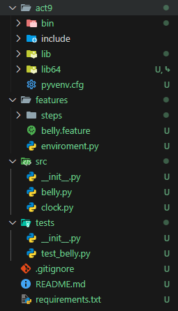
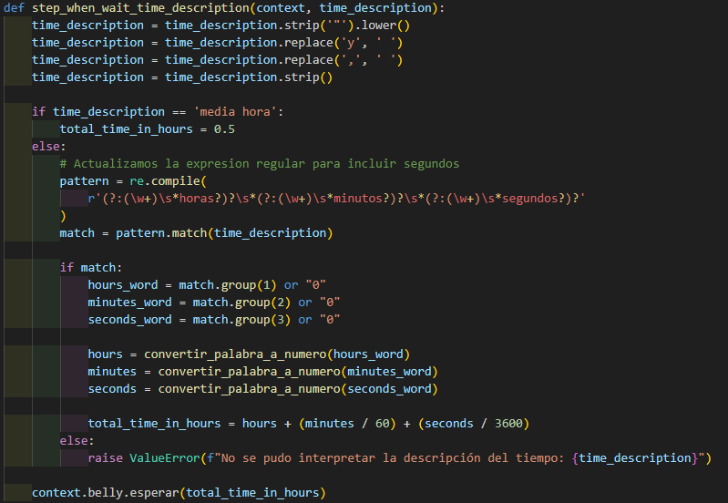
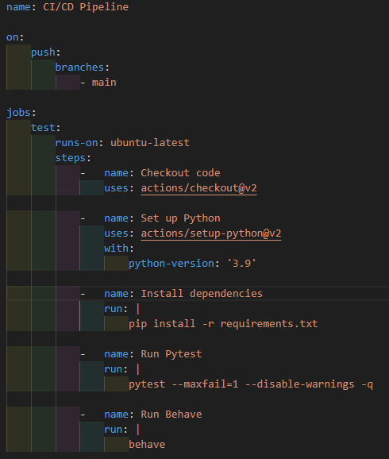
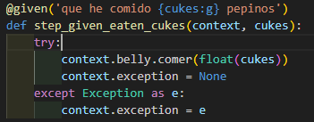
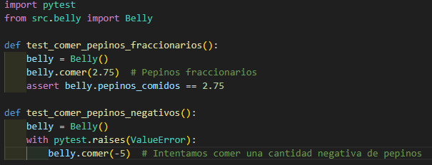
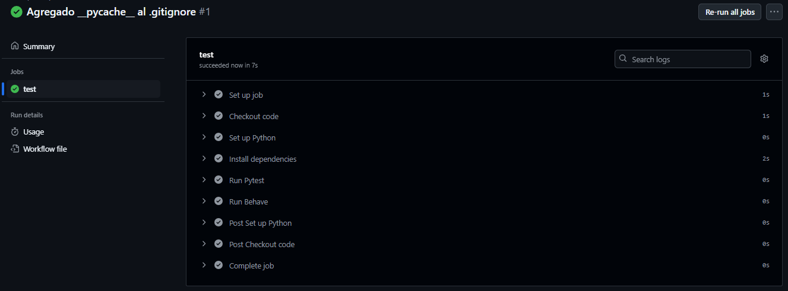
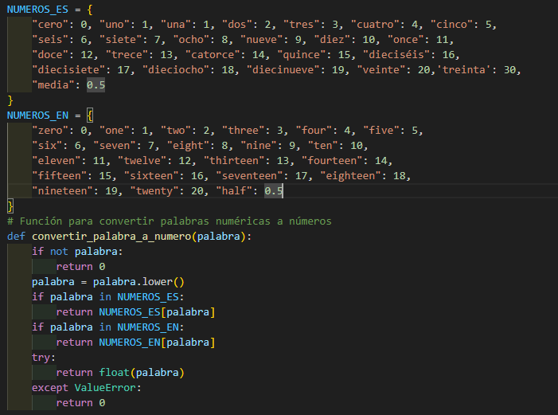
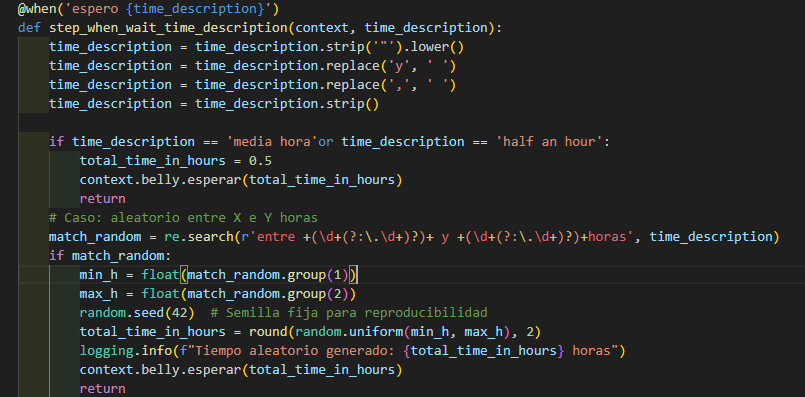

# Actividad 7 : Pruebas BDD con behave en español

## Ejercicios 

### Ejercicio 1: Añadir soporte para minutos y segundos en tiempos de espera

- Creamos la estructura del proyecto.

- Modificamos steps.py la funcion donde describimos el tiempo de espera 
    - Agregamos una descripcion para reemplazar "," por espacio.
    - Tambien modificamos el regex para aceptar segundos 
    - Agregamos la conversion de palabras a numeros a segundos. 

- Agregamos un escenario de prueba en gherkin para la validacion de este caso 
- Agregamos test para la logica de validad la conversion de palabra a numero.
- Desarrollamos el ci.yml para el pipeline en Github Actions.

### Ejercicio 2: Manejo de cantidades fraccionarias de pepinos
-  Modificamos la clase belly para que no acepte cantidades negativas de pepinos 
-  En steps.py la funcion de cantidad de pepinos comidos agregamos que acepte numeros fraccionarios con float(cukes) hacemos un try-except para no romper el escenario y seguir el flujo.

- Creamos dos test para los dos escenarios de comer pepinos franccionarios y no aceptar cantidades negativas 

- Vemos la ejecucion limpia del pipeline en Github Actions

### Ejercicio 3: Soporte para idiomas múltiples (Español e Inglés)

- Añadimos diccionario para ingles y español en nuestro steps.py.
- A la vez hacemos que la funcion convertir palabra detecte si es palabra en ingles o español 

### Ejercicio 4: Manejo de tiempos aleatorios

- Generamos un valor aleatorio entre un rango dado en el escenario donde extraemos el menor y mayor valor en el cual esaremos una semilla estandar que es la 42 para generar el tiempo aleatorio
- Luego imprimimos el tiempo aleatorio elegido 
- Añadimos escenario de prueba 

 
