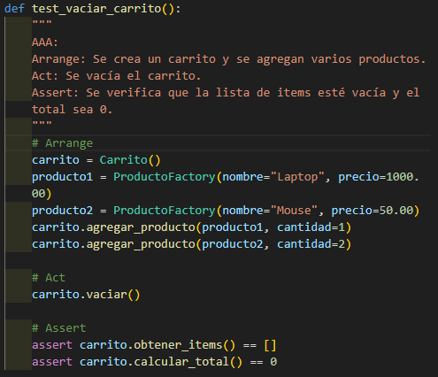
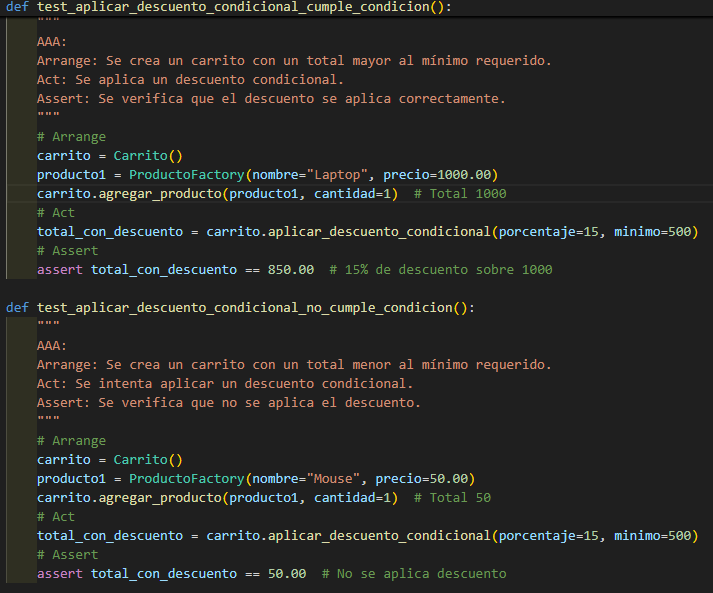
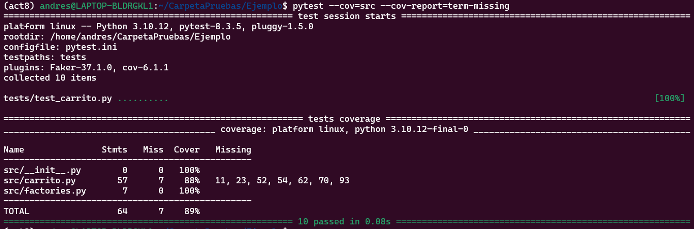

# Actividad 8: El patrón Arrange-Act-Assert

Hecho por Andres La Torre Vasquez para el curso de Desarrollo de software.

## Estructura del proyecto y configuracion inicial

```bash
Ejemplo/
├── src/
│   ├── __init__.py
|   ├── carrito.py
│   └── factories.py
├── tests/
│   └── test_carrito.py
├── requirements.txt
└── pytest.ini
```
 

- Con su respectiva logica base del repo y probamos los test a continuacion **pytest --cov=src --cov-report=term-missing** y **pytest --cov=src --cov-report=html**

 

## Ejercicios

### Ejercicio 1: Método para vaciar el carrito

- Primero implementamos en la clase carrito el metodo vaciar() que hara que self.items = [].

```python
def vaciar(self):
        """
        Vacía el carrito eliminando todos los items.
        """
        self.items = []
```

- Proseguimos haciendo un test para verificar que la lista de items este vacia y el costo total sea 0.
 

- Vemos que los test pasaron la prueba

 

### Ejercicio 2: Descuento por compra mínima

- Implementamos el metodo **aplicar_descuento_condicional(porcentaje, minimo)**
  en la clase carrito.py para que verifique si se paso el minimo y si se cumple la condicion se hace un descuento 

```python
def aplicar_descuento_condicional(self, porcentaje, minimo):
        """
        Aplica un descuento al total del carrito si el total supera un monto mínimo.
        Si no se cumple la condición, retorna el total sin descuento.
        El porcentaje debe estar entre 0 y 100.
        """
        if porcentaje < 0 or porcentaje > 100:
            raise ValueError("El porcentaje de descuento debe estar entre 0 y 100")
        total = self.calcular_total()
        if total >= minimo:
            return total * (1 - porcentaje / 100)
        return total
```
- Test para verificar si se cumple o no la condicion de superar el minimo para aplicar el descuento
 
- Se pasaron con exito las pruebas 
 

- Ahora un test para verificar que el procentaje este en 0 y 100 sino sera un porcentaje invalido
 
- tests exitosos
 

### Ejercicio 3: Manejo de stock en producto

- Añadimos en la clase Producto de **carrito.py** self.stock = stock en el constructor y actualizamos **factories.py** para generar el stock aleatorio entre 1 y 100
```python
class Producto:
    def __init__(self, nombre, precio, stock):
        self.nombre = nombre
        self.precio = precio
        self.stock = stock
    def __repr__(self):
        return f"Producto({self.nombre}, {self.precio}, stock={self.stock})"
```

```python
stock = factory.Faker("random_int", min=1, max=100)
```

 

- Test para verificar que el producto esta o excede en el stock


- Pruebas exitosas

  

### Ejercicio 4: Ordenar items del carrito

  
  

### Ejercicio 5: Uso de Pytest Fixtures

  

- **Refactorizamos**

  
### Ejercicio 6: Pruebas parametrizadas

  

### Ejercicio 7: Calcular impuestos en el carrito

  

### Ejercicio 8: Aplicar cupón de descuento con límite máximo

**OBJETIVO**
- Implementar un método aplicar_cupon(descuento_porcentaje, descuento_maximo) que aplique un cupón de descuento al total del carrito, pero asegurándose de que el descuento no supere un valor máximo.

  

### Ejercicio 9: Validación de stock al agregar productos (RGR)

**OBJETIVO**

- Asegurarse de que al agregar un producto al carrito, no se exceda la cantidad disponible en stock.


**RESULTADO**

Pasamos todas las pruebas y tuvimos una cobertura de codigo del 91% lo cual es muy bueno.

  
