# Actividad 9: Red-Green-Refactor
### Autor: Andres La Torre Vasquez

## Introducción a Red-Green-Refactor

- Red-Green-Refactor es un ciclo de TDD que constara de 3 etapas :
    - Red (Fallo): Escribir una prueba que falle porque la funcionalidad aún no está implementada.
    - Green (Verde): Implementar la funcionalidad mínima necesaria para que la prueba pase.
    - Refactor (Refactorizar): Mejorar el código existente sin cambiar su comportamiento, manteniendo todas las pruebas pasando.

- Resultado de esta primera parte basica de ejemplos 

Archivo **shopping_cart.py**

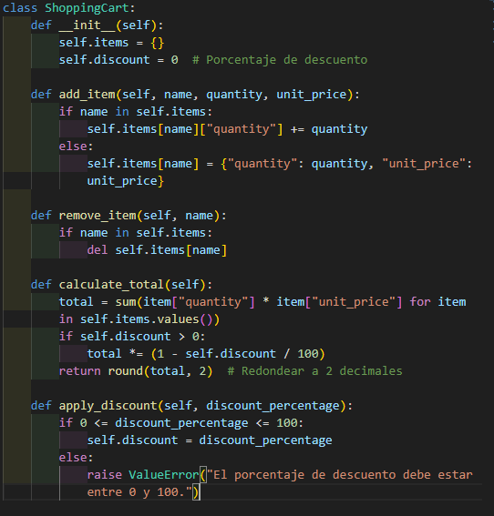 

Archivo **test_shopping_cart.py**

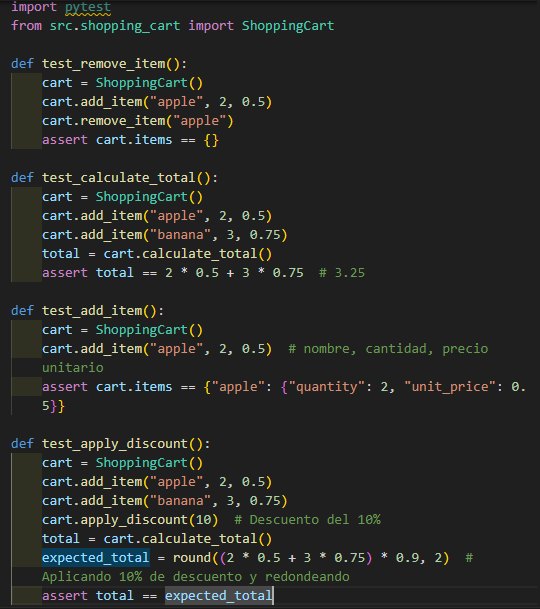 

**Resultados exitosos de las pruebas:** 

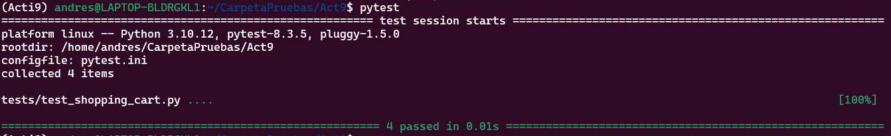

## RGR, mocks, stubs e inyección de dependencias

**test_shopping_cart.py**

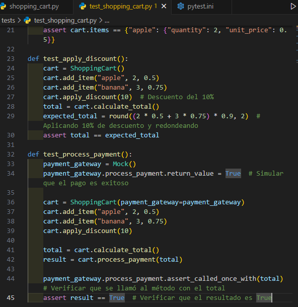

**Resultados exitosos de las pruebas**

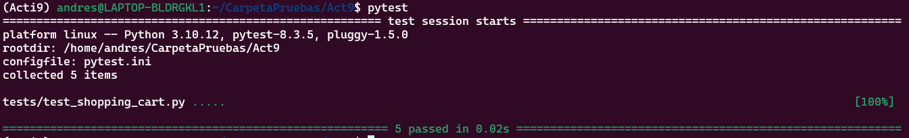

## Ejercicios 

### Iteración 1: Agregar usuario (Básico)

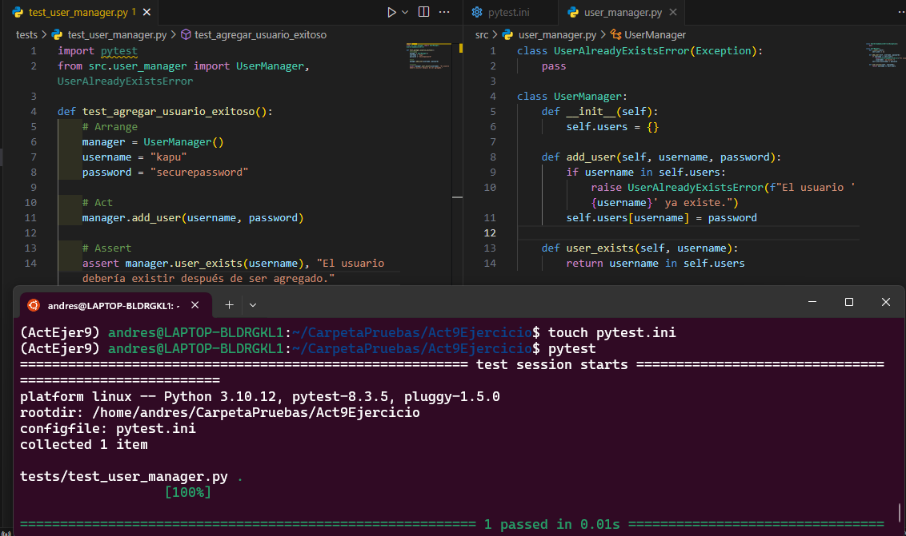

### Iteración 2: Autenticación de usuario (Introducción de una dependencia para Hashing)
**tests/test_user_manager.py**

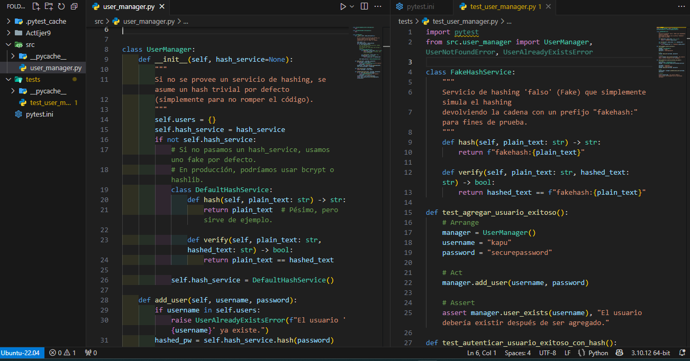

**Test exitoso**

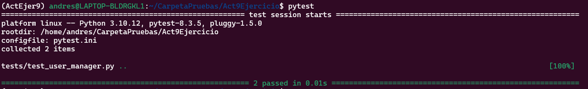

### Iteración 3: Uso de un Mock para verificar llamadas (Spy / Mock)

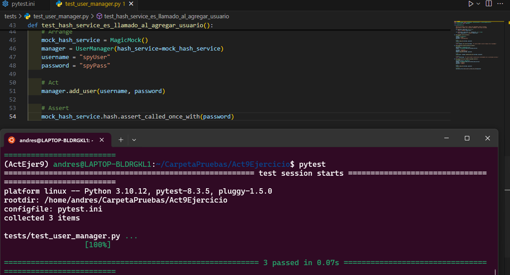

### Iteración 4: Excepción al agregar usuario existente (Stubs/más pruebas negativas)

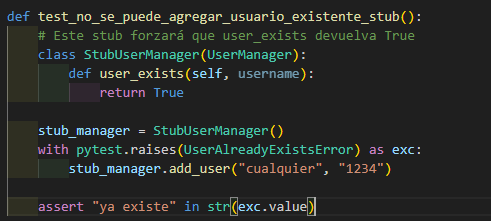

### Iteración 5: Agregar un "Fake" repositorio de datos (Inyección de Dependencias)

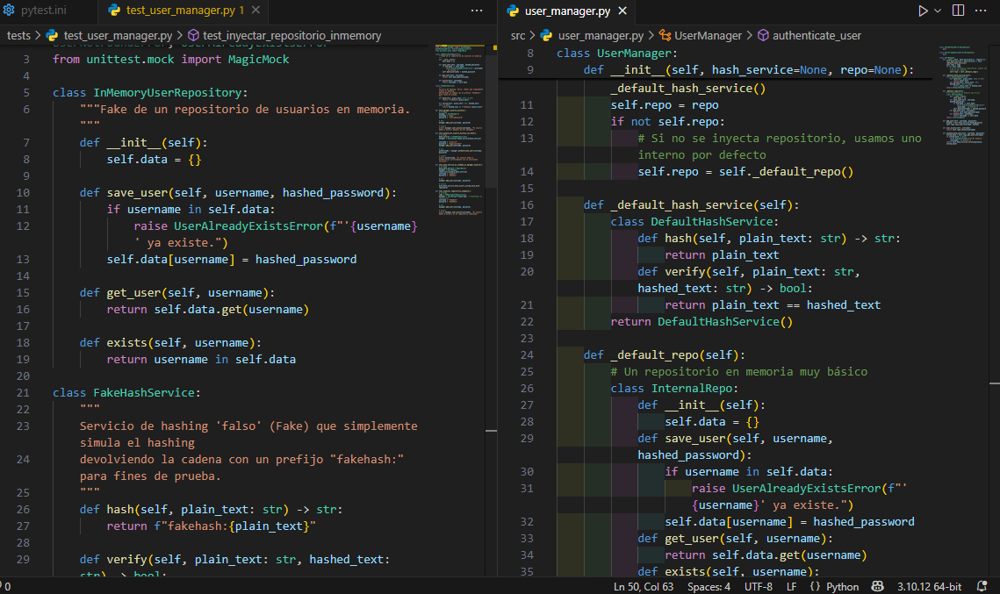

## Ejercicio integral 
