# Dirigida 2
# Actividad: Exploración y administración avanzada de Git mediante un script interactivo

#### Autor : Andres La Torre Vasquez 

## Procedimiento de la actividad

**Requisitos: Descargar o copiar el contenido de https://github.com/kapumota/DS/blob/main/2025-1/git_avanzado.sh para poder realizar las pruebas**

### Opción: agregar un submódulo (Opción 2)

- Primeramene agregamos el archivo **git_avanzado.sh** a nuestra carpeta y le damos permisos con **chmod +x git_avanzado.sh**.

- Ejecutamos el script con **./git_avanzado.sh**

- Para este punto usaremos un repositorio de prueba para el submodulo https://github.com/Jun1el/PruebaDirigida2 

- Adicionalmente hize un commit al inicio para poder trabajar mas adelante con commits que requiere la actividad.

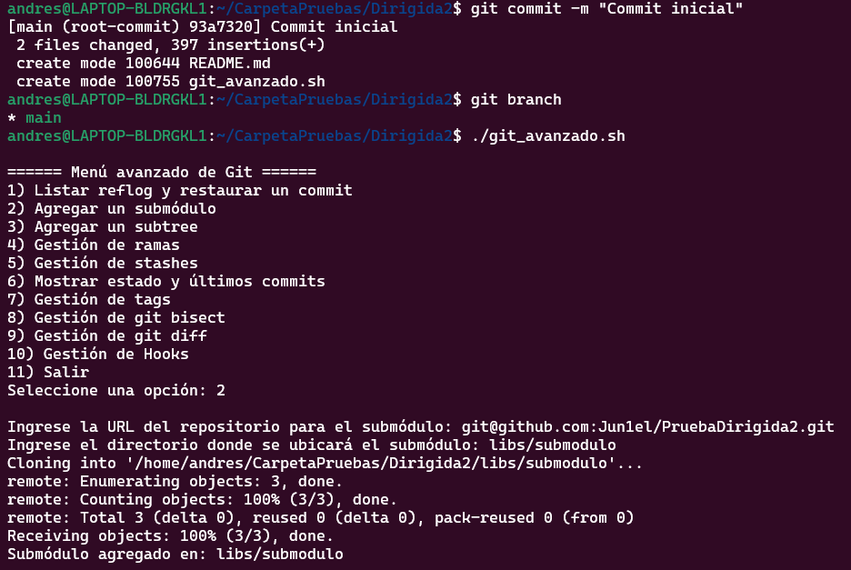

### Opción: Gestión de ramas (Opción 4)

- Primero listamos las rama con la opcion "a".

- Luego la opcion "b" para crear una nueva rama en este caso **feature/login**

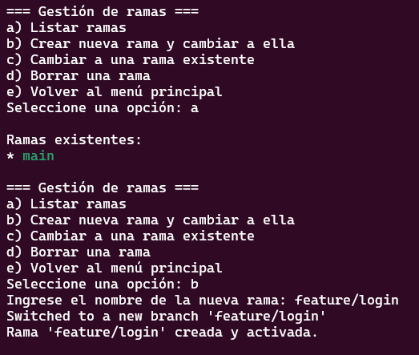

### Opción: Gestión de git diff (Opción 9)

- Primero agregamos texto al readme para poder ver las diferencias con **git diff**
- Seleccionamos la opcion "9"

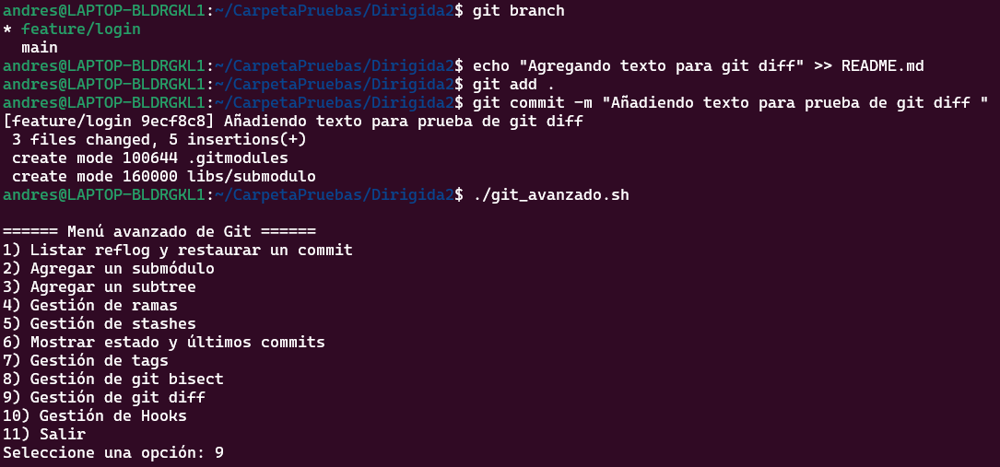

- Seleccionamos la opcion "c" para comparar las ramas

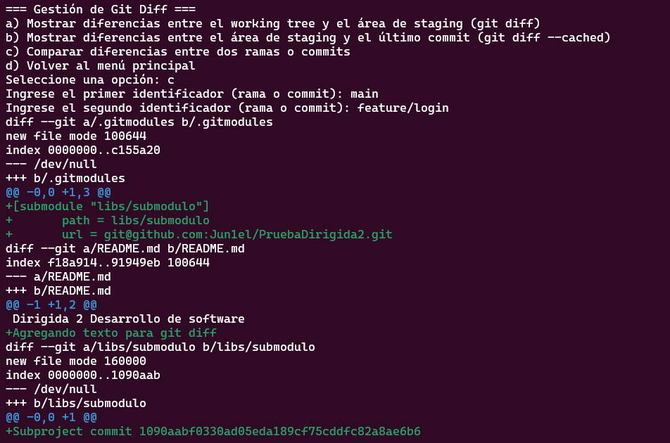

### Opción: Gestión de hooks (Opción 10)

- Escogemos la opcion "10" 
- Usamos la opcion "b" para instalar un hook e ingresamos el hook **pre-commit**
- Escribimos el texto **echo "Ejecutando pre-commit hook..." && exit 0**
- Y finalmente vemos que se instalo correctamente el hook.

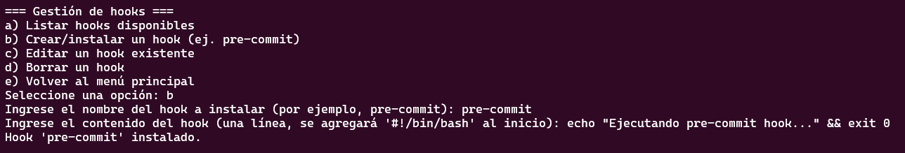

## Preguntas

- ¿Qué diferencias observas en el historial del repositorio después de restaurar un commit mediante reflog?
- ¿Cuáles son las ventajas y desventajas de utilizar submódulos en comparación con subtrees?

| Característica       | Submódulos                             | Subtrees                             |
|----------------------|----------------------------------------|---------------------------------------|
| **Ventajas**         | - Mantiene repos separados.            | - Todo el código está en un solo repo. |
| **Desventajas**      | - Difícil de clonar/configurar.        | - Más difícil de mantener actualizaciones. |
|                      | - Complica el flujo de trabajo.        | - Historial del proyecto externo se mezcla. |
| **Ideal para…**      | - Dependencias bien definidas.         | - Integraciones profundas o un solo repo para todo. |

- ¿Cómo impacta la creación y gestión de hooks en el flujo de trabajo y la calidad del código?

**Impactos positivos:**

Previenen errores antes de que lleguen al repositorio (ej. linters, tests).

Automatizan tareas repetitivas como formateo de código.

**Impactos negativos o desafíos:**

Requieren configuración inicial y no funcionan igual en todos los sistemas.

No están versionados por defecto en Git (`.git/hooks` está fuera del control de versiones).

Pueden ser una barrera para nuevos colaboradores si no se documentan bien.

- ¿De qué manera el uso de git bisect puede acelerar la localización de un error introducido recientemente?

**git bisect** aplica una búsqueda binaria entre un commit "bueno" y uno "malo" reduciendonos el número de pruebas.

En vez de revisar 100 commits uno por uno, podrías encontrar el commit con el error en solo 7 pasos (`log₂(100) ≈ 7`).

Ahorra tiempo y elimina suposiciones.

Ideal para errores introducidos en ramas con mucho historial.

- ¿Qué desafíos podrías enfrentar al administrar ramas y stashes en un proyecto con múltiples colaboradores?

    - **Ramas :** La principales dificultades son los nombres poco claros o conflictos frecuentes por falta de sincronización(PR, merge o rebase).
    - **Stashes :** Se olvidan facilmente si no tienen descripcion o conflictos si el codigo base cambió.

## Ejercicios

### 1 . Extiende el menú de gestión de ramas para incluir la funcionalidad de renombrar ramas.

- Implementamos la logica para que se renombre la rama seleccionada. 

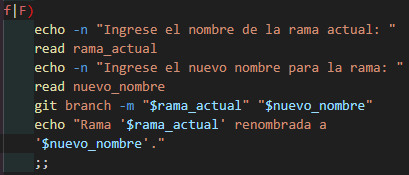

- Vemos el mensaje que se cambio el nombre de la rama

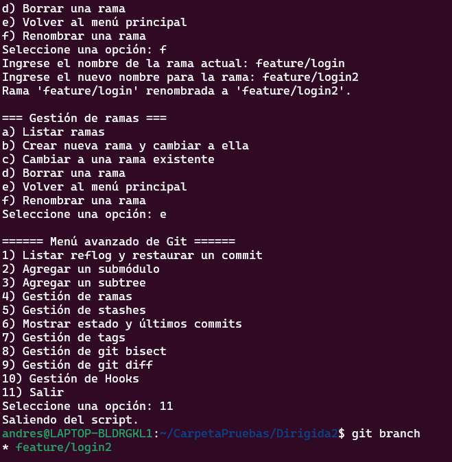

### 2 . Amplia la sección de "Gestión de git diff" para permitir ver las diferencias de un archivo específico entre dos commits o ramas.

- Implementamos la funcionalidad para que lea los dos identificadores ya sea commits o ramas.

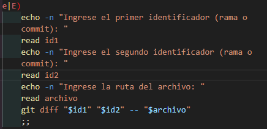

- Nos muestra el texto que añadi para la prueba de git diff.

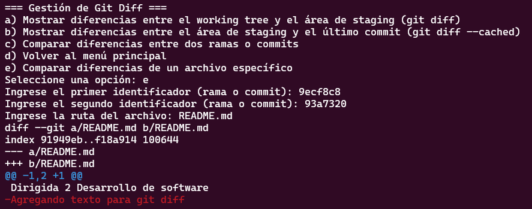

### 3 . Crea una función que permita instalar automáticamente un hook que, por ejemplo, verifique si se han agregado comentarios de documentación en cada commit.

- Implementamos la logica de la funcion para instalar hook que nos vereficara la documentacion al ver si tiene comentarios.

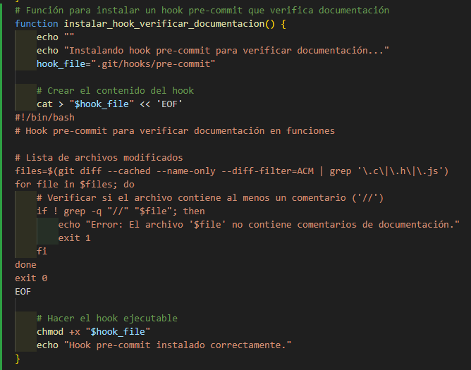

- Vemos que se instalo el hook correctamente

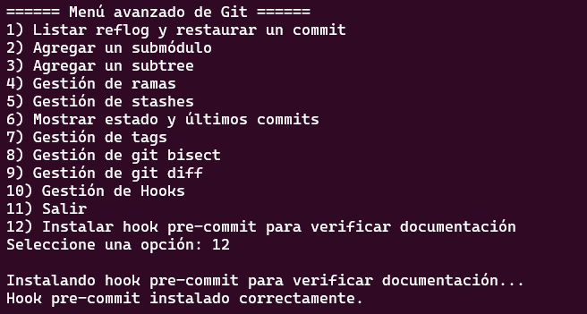

- Vemos el correcto funcionamiento de el hook al lanzar error diciendo que no tiene documentacion y en el segundo cuando ya agregue un comentario si lo acepta.

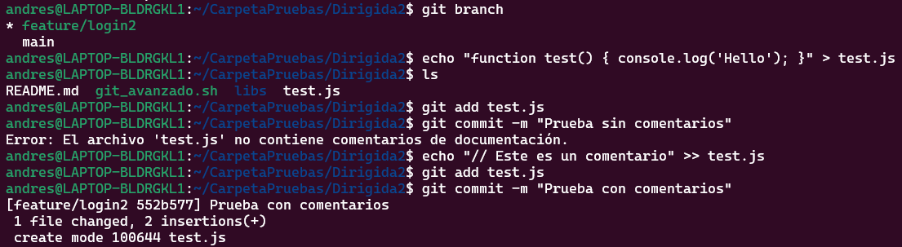

### 4 . Implementa una opción en el script que realice un merge automatizado de una rama determinada en la rama actual, incluyendo la resolución automática de conflictos (siempre que sea posible).

- Implementamos la logica para el merge automatico donde usaremos la funcionalidad THEIRS que si hay conflicto toma la version de la rama que se esta fusionando.

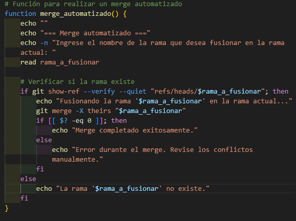

- Vemos que se ejecuto correctamente el merge.

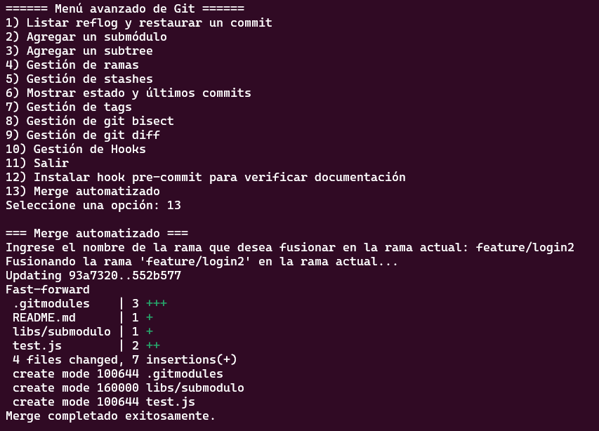

### 5 . Implementa una opción en el script que genere un reporte con información relevante del repositorio (estado, ramas, últimos commits, stashes, etc.) y lo guarde en un archivo.

- Implementacion del reporte con informacion relevante de git y almacenandola en un .txt .

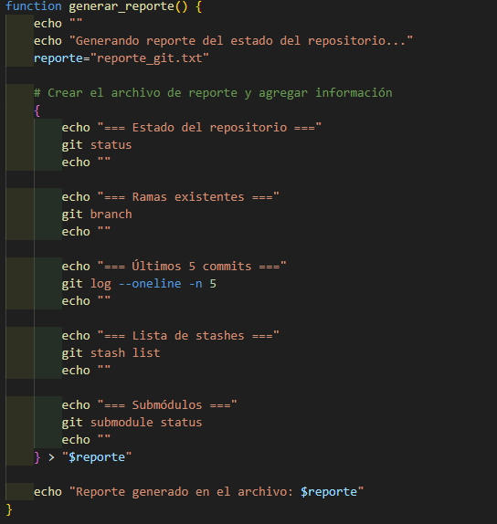

- Reporte generado correctamente 

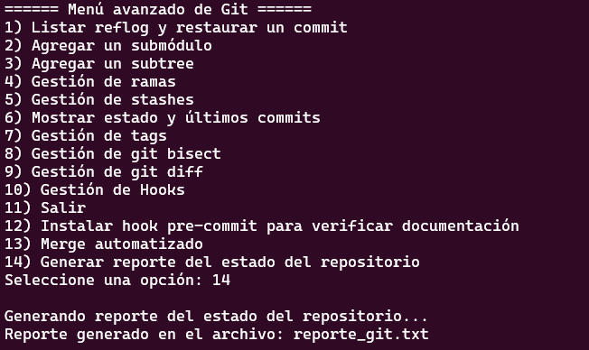

- Vemos el contenido generado automaticamente en el txt.

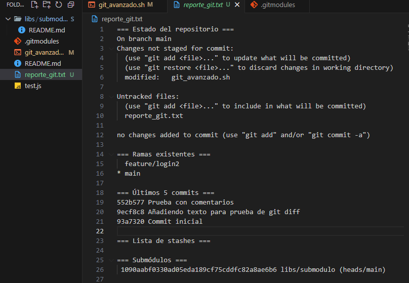

